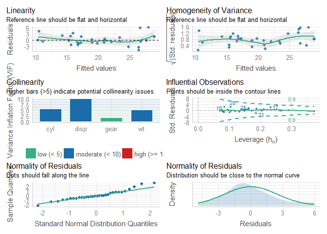

We normally make assumptions When using `linear regression` to model relationship between response variable and one or more dependent variable.They are supposed to be meet before drawing any inference about regression parameters.Some of the assumptions are as follows:

* The true relationship is linear
* Errors are normally distributed
* Homoscedasticity of errors (or, equal variance around the line).
* Independence of the observations

The following plot is used to visualize all above assumption.We are going to use `mtcars` dataset for our analysis.


```r
# required libraries and data

library(performance)
library(see)
data("mtcars")
```


```r
# model creation
model<-lm(mpg~ wt+cyl+gear+disp,data = mtcars)
```


```r
#checking assumptions

check_model(model)
```

```
## Registered S3 method overwritten by 'datawizard':
##   method                    from
##   plot.visualisation_recipe see
```

<!-- -->


     
